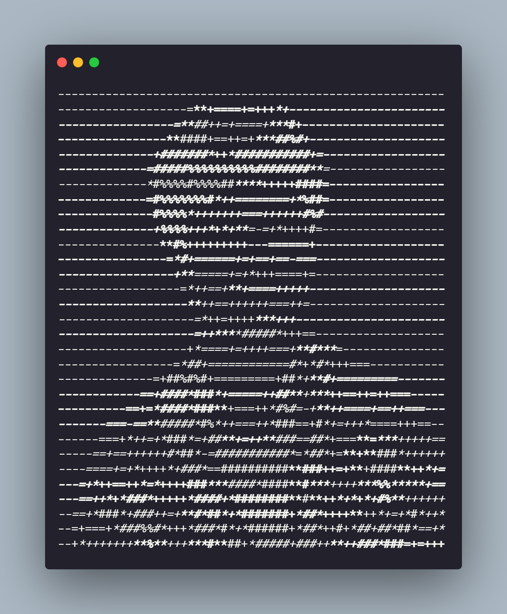

[](https://git.io/typing-svg)
<table>
<tr>
<td>

```

```

</td>
<td>

```ansi
                    bijit1234@github
                    ─────────────────
OS: ..................... Windows 11, Android 15
Uptime: .................. 21 years, 7 months, 29 days
Languages.Programming: ... Python, JavaScript, ...
Languages.Real: .......... Bengali, English, ...
Hobbies: ................. Sculpting, Painting, ...
```

📫 **Contact**

[](https://linkedin.com/in/bijitpolley)
[](mailto:bijitpolley@email.com)

</td>
</tr>
</table>


### 🛠️ Skills


### 📊 GitHub Stats


### 👀 Profile Views

